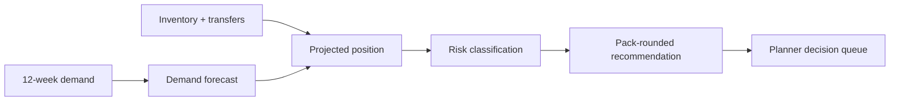

# Inventory Decision Engine

An interactive decision-support system that turns SKU demand, inventory, safety stock, transfers, and supplier lead times into explainable replenishment recommendations.

**[Open the live planner dashboard](https://pratyushdhakad.github.io/inventory-decision-engine/)**

> Portfolio demonstration using synthetic data only. The operating logic is inspired by real planning problems, not copied from any employer system.

## Build status

The tested decision engine now powers a responsive planner cockpit. It currently:

- generates reproducible 12-week SKU demand and inventory snapshots;
- produces a blended four-week demand forecast;
- credits inbound transfers only when they arrive inside the replenishment window;
- classifies stockout, below-safety, healthy, and excess-inventory risk;
- rounds suggested orders to supplier pack sizes; and
- compares base, promotion, and supplier-delay scenarios;
- filters the decision queue by risk, SKU, or warehouse;
- explains the inputs behind each recommended action; and
- deploys the static dashboard automatically through GitHub Pages;
- evaluates forecast quality with 48 leakage-safe walk-forward holdouts; and
- translates decisions into explicitly modeled purchase, stockout, and excess-capital exposure.

## The business question

For each SKU and warehouse, what action should a planner take now—and why?

The output is designed for a supply-chain or inventory owner who needs a short, auditable queue of decisions instead of another raw forecast export. The live dashboard makes scenario changes visible without hiding the assumptions behind them.

## Quick start

```bash
python3 -m venv .venv
source .venv/bin/activate
pip install -r requirements.txt
make test
make run
```

Generated outputs are written to `artifacts/`, and the self-contained dashboard is written to `dashboard/index.html`.

## Decision flow



## AI-augmented build method

I use AI as an engineering multiplier for implementation, edge-case generation, and documentation. I own the business framing, assumptions, architecture, validation rules, evaluation, and every published decision. Generated work is not accepted until it runs, passes tests, and can be explained.

## Evaluation and impact guardrails

- Forecast quality is measured out of sample with walk-forward holdouts; see [the evaluation notes](docs/forecast-evaluation.md).
- The test suite includes an anti-leakage check that changes a holdout actual and confirms its prediction does not move.
- Financial values use synthetic unit costs and a stated 22% annual holding-rate assumption.
- Modeled exposure is presented for prioritization, not claimed as realized or guaranteed savings.
- The [five-minute interview walkthrough](docs/interview-walkthrough.md) covers the problem, architecture, evaluation, value, and production trade-offs.

## Repository map

```text
src/inventory_decision_engine/   generation, validation, forecasting, decisions
sql/                             portable inventory-position model
tests/                           business-rule and pipeline tests
data/                            deterministic synthetic inputs
artifacts/                       generated recommendations and scenario summary
dashboard/                       interactive planner cockpit and social preview
docs/                            assumptions and decision rules
.github/workflows/               continuous integration and Pages deployment
```

## Current limitations

- The forecast is deliberately interpretable; it does not model seasonality or causal promotion effects.
- Order suggestions assume one supplier lead time and pack size per SKU/warehouse.
- Recommendations support human review; they do not place purchase orders.
- Calibrated service levels, validated carrying and stockout costs, minimum order quantities, and supplier capacity are future extensions.

## License

MIT
